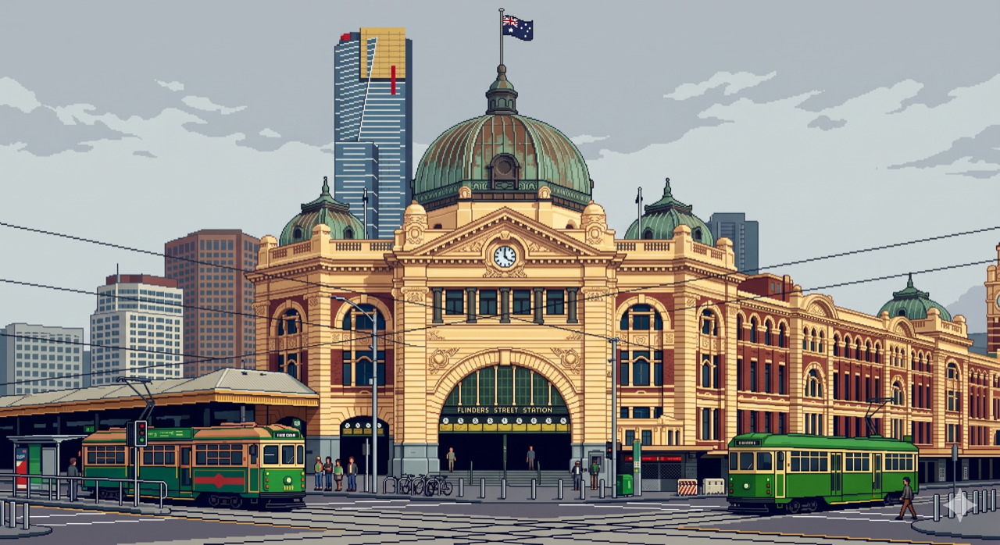

<!--
  GitHub profile README for user "brijesh2202".
  Repo MUST be named exactly:  brijesh2202/brijesh2202  (public)
  Put this file at the repo root as README.md.
-->

  

  
  
  

---

### 👋 About me

Master of Data Science candidate at **RMIT** (Machine Learning concentration), based in Melbourne 🇦🇺.
I came to data science from a game-development background in C#, and now work across **machine learning, statistical modelling, and analytics** — building models and pipelines, then shipping them as apps people can actually use.

🔭 Open to **machine learning · data science · quantitative** roles.

---

### 🛠️ Tech & tools

---

### 🚀 Featured projects

| Project | What it does | Stack |
|---|---|---|
| [Movie Recommendation System](https://github.com/brijesh2202/Recommendation-System-built-using-Numpy-and-Python) | User/item collaborative filtering (Pearson-KNN) + hybrid, NumPy from scratch on MovieLens 100k | Python · NumPy |
| [SIG × UNSW Algothon](https://github.com/brijesh2202/Susquehanna-Algothon-2025-Strategy) | RSI + MACD equities strategy, backtested over 1,000 days — Sharpe 0.61 | Python · NumPy |
| [PhonePe Data Visualisation](https://github.com/brijesh2202/PhonePe-Data-Viz) | Cleaned PhonePe Pulse data → SQL → interactive dashboard | Python · SQL · Plotly |
| [YouTube Data Harvesting](https://github.com/brijesh2202/Youtube_data_Harvesting) | YouTube API → MongoDB → MySQL pipeline + analysis | Python · MongoDB · MySQL |
| [Airbnb Analysis](https://github.com/brijesh2202/Airbnb-Analysis) | Pricing, occupancy & review drivers with geospatial viz | Python · Plotly |

---

 

---

  <i>📍 Melbourne, AU · Let's build something.</i>

